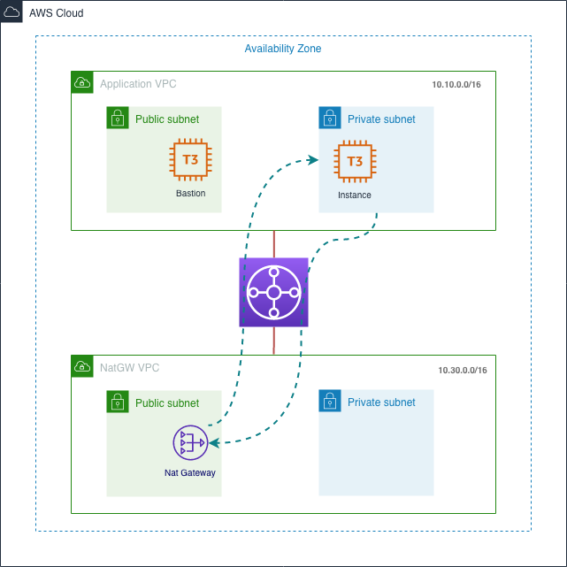
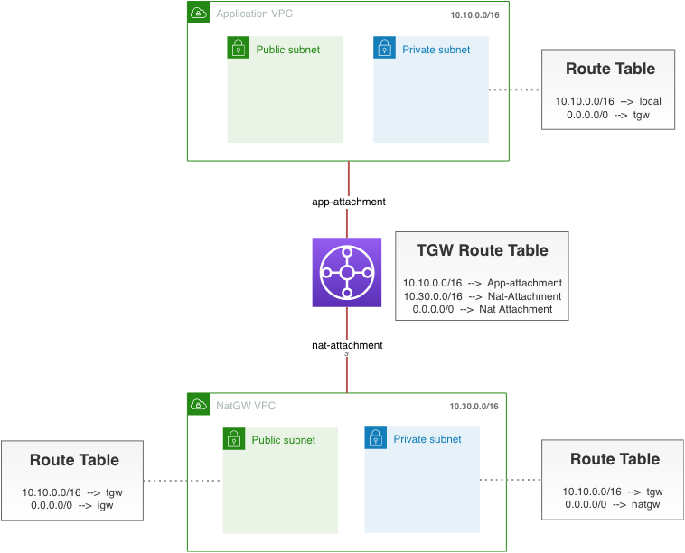

# Sharing a NAT Gateway through AWS Transit Gateway

Introduction of Transit Gateway made it possible to share a NAT Gateway among different accounts and VPCs. 
This proof of concept implementation demonstrates how an instance in a private subnet accesses Internet through
 a NAT Gateway in another VPC through Transit Gateway. This implementation uses AWS CDK for Python.
 
 ## High-Level Architecture



## VPC Setup

CDK creates a NAT Gateway by default whenever a private subnet is configured. However, as we are trying to setup a shared
 NAT Gateway environment, we need to setup a subnet of type ISOLATED to override the default behaviour.
 
```python
    subnet_configuration=[
        _ec2.SubnetConfiguration(
            cidr_mask=24,
            name='app-private1',
            subnet_type=_ec2.SubnetType.ISOLATED
        )
    ]
```
## Routing Tables

Requirements:

- All private subnets have a default route to TGW.
- Transit Gateway has a default route to Shared NAT VPC.
- Shared NAT GW VPC's private subnets have a default route to a NAT GW.
- Shared NAT GW VPC's public subnets have routes back to all VPCs through TGW.

In this demo, Transit Gateway only has one routing table, which is associated with all attachments. This approach makes
it possible to have full-mesh connectivity, i.e. any VPC can connect to any other. You can however change this 
behavior by creating a separate route table per attachment.
 



## EC2 Instances

CDK launches 2 instances:

- Bastion host in the public subnet
- Test instance in the isolated subnet

You need to configure three attributes in `ec2_stack` before deploying these stacks. 

```
# The CIDR range for SSH access
SSH_IP = '0.0.0.0/0'

# SSH PORT
SSH_PORT = 22

# The name of the key pair to access the instances. This key pair has to be available in the correct region.
KEY_PAIR = 'tgw_test'
```

## Security Groups

Bastion Host Security Group

bastion-sg (CIDR and Port be configured in `ec2-stack`)
```
SSH - Port 22 - 0.0.0.0/0 
```

Test Instance Security Group

ec2-sg
```
SSH - Port 22 - bastion-sg 
```

## Transit Gateway

There are no high-level CDK constructs for Transit Gateway at the moment. For this reason, Cfn constructs are used to 
create a Transit Gateway and its attachments.

## Gateway Attachments

Both TGW attachments are associated with private networks.

# Pricing

You are not charged for creating a TGW but instead you are billed hourly for the number of attachments and 
the amount of traffic that flows through Transit Gateway. 


You also need to consider additional data transfer charges through TGW.

The following estimation is based on eu-west-1 region.

```
NAT Gateway

$0.048/hr --> $34.56/month

$0.048/GB data transfer 

Transit Gateway

$0.05/h per TGW attachment --> $36/month

$0.02/GB data transfer

EC2 Instances
t3a.nano  $0.0051/hour --> $3.672/month
```

2 TGW attachments - $72

2 t3a.nano instance - $7.3

1 NAT Gateway - $34.56

Total ~= $120/month, $0.20/hr


## Deploying a CDK Python project!

```
python3 -m venv .env`
```

```
$ source .env/bin/activate
```

If you are a Windows platform, you would activate the virtualenv like this:

```
% .env\Scripts\activate.bat
```

Once the virtualenv is activated, you can install the required dependencies.

```
$ pip install -r requirements.txt
```

At this point you can now synthesize the CloudFormation template for this code.

```
$ cdk synth
```

To add additional dependencies, for example other CDK libraries, just add
them to your `setup.py` file and rerun the `pip install -r requirements.txt`
command.

### Useful commands

 * `cdk ls`          list all stacks in the app
 * `cdk synth`       emits the synthesized CloudFormation template
 * `cdk deploy`      deploy this stack to your default AWS account/region
 * `cdk diff`        compare deployed stack with current state
 * `cdk docs`        open CDK documentation
